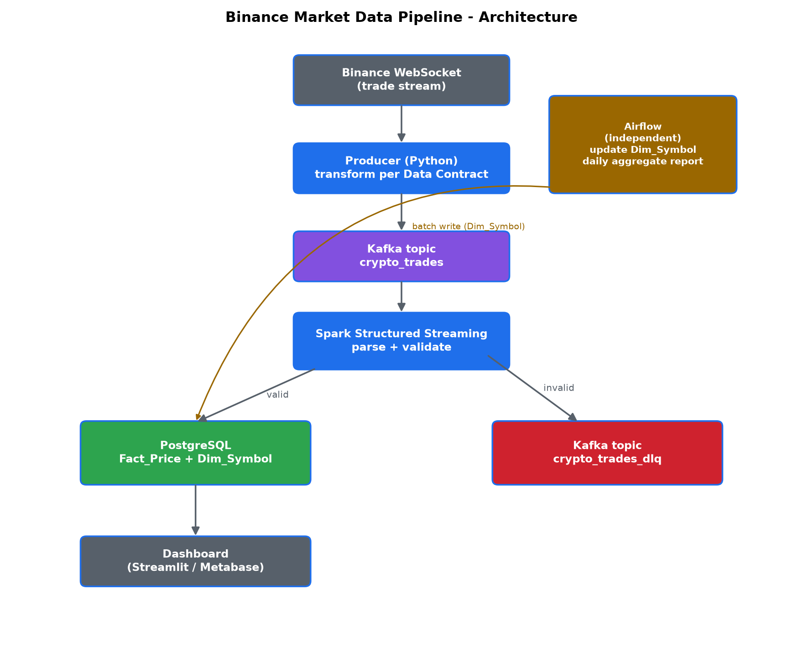
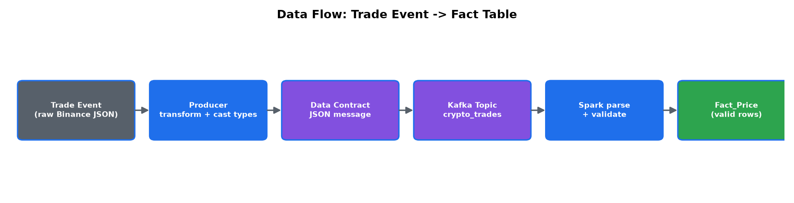
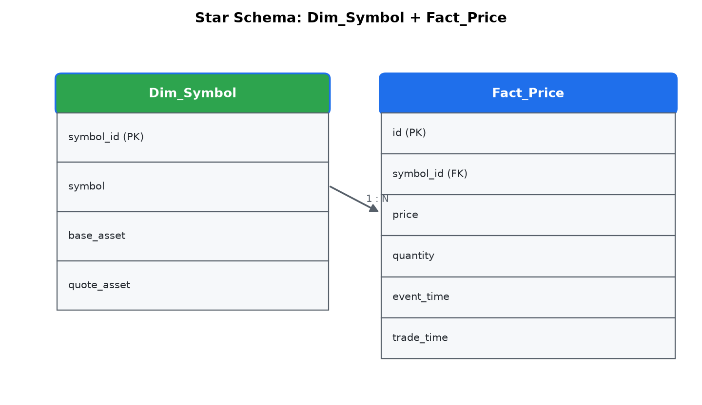

# Binance Market Data Pipeline

Pipeline dữ liệu streaming thời gian thực: lấy dữ liệu giao dịch (trade) từ Binance qua WebSocket công khai, đẩy qua Kafka, xử lý bằng Spark Structured Streaming, và lưu vào PostgreSQL theo star schema để phục vụ phân tích/dashboard.

```
Binance WebSocket → Producer (Python) → Kafka → Spark Structured Streaming → PostgreSQL → Dashboard
                                                                            ↘ Kafka DLQ (dữ liệu bẩn)
Airflow chạy song song, độc lập: batch job cập nhật Dim_Symbol + báo cáo aggregate hàng ngày
```

## 1. Kiến trúc



Airflow **không** tham gia vào luồng streaming realtime. Producer chạy như một service độc lập, luôn sống (long-running process); Airflow chỉ đảm nhiệm các tác vụ theo lịch (batch).

## 2. Luồng dữ liệu



`Trade Event → JSON thô → Producer transform → Data Contract JSON → Kafka Topic (crypto_trades) → Spark parse + validate → Fact_Price (valid) / crypto_trades_dlq (invalid)`

### Star schema



## 3. Công nghệ sử dụng

| Thành phần | Công nghệ |
|---|---|
| Producer, transform dữ liệu | Python (`websocket-client`, `kafka-python`) |
| Message broker | Apache Kafka + Zookeeper |
| Xử lý streaming | Apache Spark Structured Streaming |
| Lưu trữ | PostgreSQL (star schema: Fact_Price + Dim_Symbol) |
| Hạ tầng | Docker Compose |
| Batch job phụ trợ | Apache Airflow |
| Dashboard | Streamlit (query trực tiếp PostgreSQL) |

## 4. Cấu trúc thư mục

```
binance-market-data-pipeline/
├── docker-compose.yml
├── .env.example                  # copy sang .env truoc khi chay
├── config/
│   └── settings.yaml             # symbol list, kafka topic, spark configs
├── data/
│   ├── checkpoints/              # Spark checkpoint - KHONG commit git
│   └── warehouse/
├── docs/                         # architecture.png, pipeline.png, star_schema.png
├── sql/
│   ├── 001_create_tables.sql
│   ├── 002_create_indexes.sql
│   └── 003_seed_dim_symbol.sql
├── src/
│   ├── producer/                 # client.py, kafka_producer.py, main.py
│   ├── streaming/                # spark_stream.py
│   └── common/                   # config.py, logger.py, schema.py, utils.py - nguon dinh nghia DUY NHAT
├── dags/                         # update_dim_symbol.py, daily_aggregate_report.py
├── dashboard/                    # app.py (Streamlit)
└── tests/                        # test_parser.py, test_config.py, test_validation.py
```

`src/common/` là nguồn định nghĩa **duy nhất** cho Data Contract (`schema.py`), config loader và logger - cả producer lẫn Spark job đều import từ đây để tránh trường hợp sửa contract ở một bên mà quên sửa bên kia.

## 5. Data Contract

Message publish lên Kafka topic `crypto_trades` (định nghĩa tại [`src/common/schema.py`](src/common/schema.py)):

| Field Binance (raw) | Field trong Contract | Kiểu dữ liệu | Ghi chú |
|---|---|---|---|
| `e` | *(loại bỏ)* | — | Topic đã cố định là trade, không cần lưu |
| `E` | `event_time` | timestamp (ISO 8601) | Đổi từ epoch ms sang ISO string |
| `s` | `symbol` | string | Ví dụ: `BTCUSDT` |
| `p` | `price` | double | Binance trả string - ép kiểu float ở Producer |
| `q` | `quantity` | double | Binance trả string - ép kiểu float ở Producer |
| `T` | `trade_time` | timestamp (ISO 8601) | Thời điểm khớp lệnh thực tế |

```json
{
  "event_time": "2025-07-13T10:15:32.100Z",
  "symbol": "BTCUSDT",
  "price": 109000.20,
  "quantity": 0.30000000,
  "trade_time": "2025-07-13T10:15:32.095Z"
}
```

## 6. Hướng dẫn cài đặt

```bash
git clone <repo-url>
cd binance-market-data-pipeline
cp .env.example .env          # chinh sua mat khau neu can

docker-compose up -d --build
docker ps                     # xac nhan tat ca service da len

# kiem tra Kafka
docker exec broker kafka-topics --bootstrap-server localhost:9092 --list

# kiem tra Postgres
docker exec -it postgres psql -U binance -d binance -c "\dt"
```

Truy cập:
- Dashboard: http://localhost:8501
- Spark master UI: http://localhost:8081
- Airflow UI: http://localhost:8080 (user/pass trong `.env`)

### Chạy producer local (không qua Docker)

```bash
pip install -r src/producer/requirements.txt
KAFKA_BOOTSTRAP_SERVERS=localhost:9093 PYTHONPATH=src python -m producer.main
```

## 7. Hướng dẫn chạy test

```bash
pip install -r requirements-dev.txt
pytest tests/ -v
```

Đây **chỉ là unit test** cho các hàm thuần túy (`transform_raw_trade`, `is_valid_trade`, config loader) - không cần WebSocket, Kafka hay Spark cluster thật để chạy, chạy xong trong vài giây. Kiểm thử khả năng chịu lỗi thực sự (mất Kafka, mất WebSocket, restart Spark) là end-to-end/resilience testing thủ công, xem bảng bên dưới.

### Bảng kiểm thử khả năng chịu lỗi (thủ công)

| Test case | Cách thực hiện | Kỳ vọng |
|---|---|---|
| Kafka broker dừng đột ngột | `docker stop broker` | Producer log lỗi, không crash, tự retry khi Kafka lên lại |
| WebSocket mất kết nối | Ngắt mạng tạm thời | Producer tự reconnect (dữ liệu trong khoảng mất kết nối bị mất thật) |
| Spark job bị kill và restart | `docker restart streaming` | Đọc tiếp từ checkpoint, không mất/không trùng dữ liệu |
| Message dữ liệu bẩn (price null/âm) | Gửi message test thủ công vào topic | Vào DLQ topic `crypto_trades_dlq`, không crash job chính |
| PostgreSQL không khả dụng tạm thời | `docker stop postgres` | Spark batch write lỗi có log rõ ràng, retry ở micro-batch tiếp theo |

## 8. Giới hạn kỹ thuật đã biết

- **Binance WebSocket không có cơ chế resume/offset** - mất kết nối đồng nghĩa mất dữ liệu thật trong khoảng đó (khác với Kafka consumer có thể replay từ offset cũ). Muốn khắc phục cần backfill qua REST API `/api/v3/trades`.
- **Spark Structured Streaming không có JDBC sink built-in** - bắt buộc dùng `foreachBatch` để ghi PostgreSQL ([src/streaming/spark_stream.py](src/streaming/spark_stream.py)).
- **Mỗi `writeStream` cần `checkpointLocation` riêng biệt** - nhánh valid và nhánh DLQ dùng chung sẽ lỗi khi restart job.
- **Producer là single point of failure** của toàn hệ thống - muốn độ tin cậy cao hơn cần chạy nhiều instance producer với cơ chế chia symbol.
- **`src/common/` không tự động khả dụng trong Spark job** khi chạy qua `spark-submit` - phải đóng gói thành `dependencies.zip` và truyền qua `--py-files` (đã tự động hoá trong `src/streaming/Dockerfile` + `entrypoint.sh`).
- **`requirements.txt` tách theo từng service** (producer, streaming, dashboard) - gộp chung dễ xung đột version, đặc biệt với `pyspark` vốn cần khớp chính xác với Spark cluster đang chạy (ở đây `streaming/Dockerfile` build trên cùng base image `bitnami/spark` với spark-master/worker để đảm bảo khớp version).
- **Airflow dùng `SequentialExecutor` + SQLite** (chế độ `airflow standalone`) để đơn giản hoá demo - không phù hợp cho production thật (nên chuyển sang `LocalExecutor`/`CeleryExecutor` + Postgres metadata riêng nếu mở rộng).
- **Kafka/Postgres JDBC connector được tải qua `--packages` (Maven) lúc chạy** thay vì đóng gói cứng vào image - lần đầu chạy cần internet; jar được cache lại qua volume `spark_ivy_cache` cho các lần sau.

## Data đã biết trước (seed)

`sql/003_seed_dim_symbol.sql` seed sẵn `BTCUSDT`, `ETHUSDT`, `BNBUSDT` - khớp với danh sách mặc định trong `config/settings.yaml`. DAG `update_dim_symbol` (Airflow) giữ bảng này cập nhật theo danh sách symbol thực tế trên Binance.
